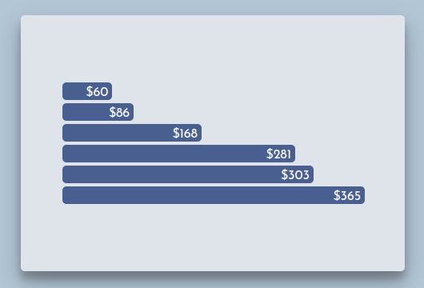
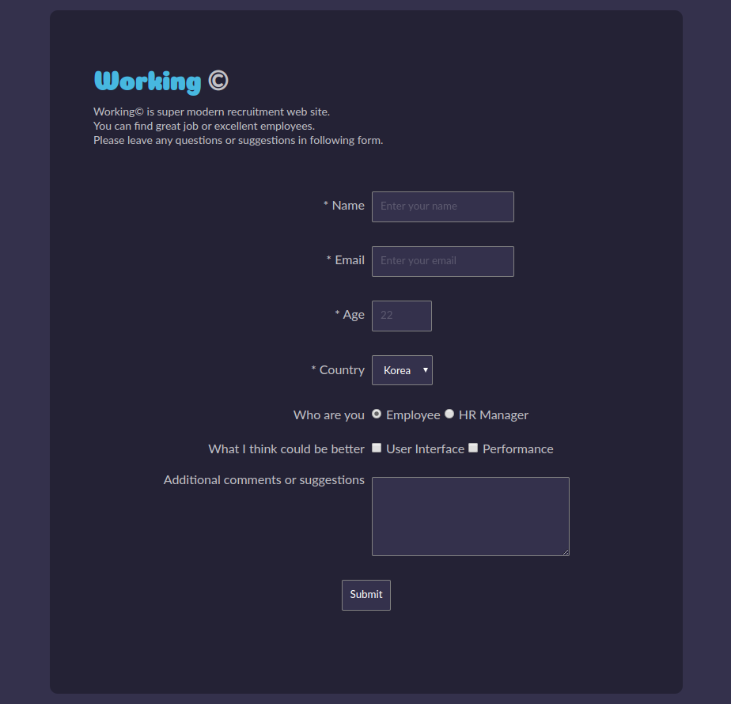

# Projects

## Visual

`Visual` projects can be represented as web site, compared to `technical` projects which is not visually represented

### css-image-grid

Responsive CSS Grid with images

- [GitHub repo](https://github.com/kvoncode/css-image-grid)
- [GitHub pages](https://kvoncode.github.io/css-image-grid/)
- [Youtube demo](https://youtu.be/xdxTXP1x_Uo)

### fcc-tribute-page

Responsive Tribute page to Elon Musk

- [GitHub repo](https://github.com/kvoncode/fcc-tribute-page)
- [GitHub pages](https://kvoncode.github.io/fcc-tribute-page/)
- [Youtube demo](https://youtu.be/8j7-l2hCNR8)

### horizontal-bar-chart

Bar chart with D3.js

- [GitHub repo](https://github.com/kvoncode/horizontal-bar-chart)
- [GitHub pages](https://kvoncode.github.io/horizontal-bar-chart/)

### fcc-survey-form

Free Code Camp Survey Form

- [GitHub repo](https://github.com/kvoncode/fcc-survey-form)
- [GitHub pages](https://kvoncode.github.io/fcc-survey-form/)

### expanding-styled-input

- [GitHub repo](https://github.com/kvoncode/expanding-styled-input)
- [GitHub pages](https://kvoncode.github.io/expanding-styled-input/)

### materialize-autocomplete

- [GitHub repo](https://github.com/kvoncode/materialize-autocomplete)
- [GitHub pages](https://kvoncode.github.io/materialize-autocomplete/)

## Technichal

`Technical` projects are important as they are the basis for visual projects

### custom-css-reset

Custom CSS reset

- [GitHub repo](https://github.com/kvoncode/custom-css-reset)

### codeforces

Solutions to Codeforces tasks (C++)

- [GitHub repo](https://github.com/kvoncode/codeforces)

### js-algorithms

Algorithms in JS

- [GitHub repo](https://github.com/kvoncode/js-algorithms)

### template-files

Template config files for Babel, Webpack, React.js, etc.

- [GitHub repo](https://github.com/kvoncode/template-files)

### fcc-javascript

Free Code Camp Javascript algorithms

- [GitHub repo](https://github.com/kvoncode/fcc-javascript)

## Public contributions

`Public contributions` are contribution to GitHub repositories, Mozilla Developers Network docs, etc. 