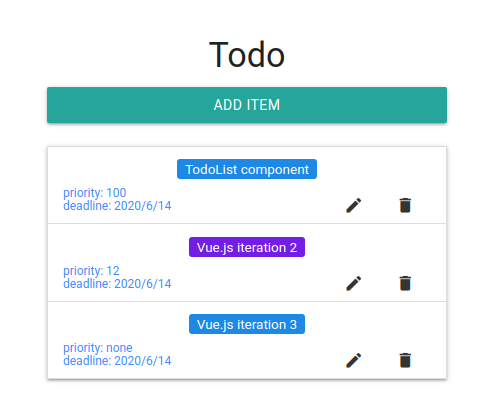
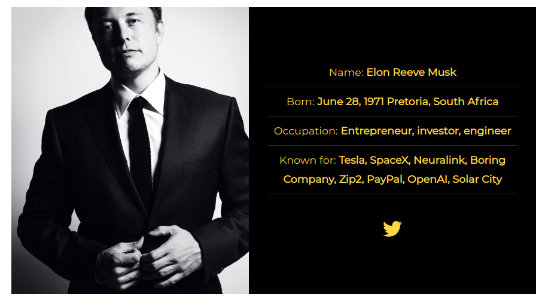

# Projects

## 3 best projects

### Todo app 

#### Stack

- Vue.js
- Vuex
- materialize.css

#### Links

- [GitHub repo](https://github.com/kvoncode/vuecli-todoapp)
- [Glitch Demo](https://kvoncode-vuecli-todo-dist.glitch.me/)
- [Medium article](https://medium.com/@kvoncode/todo-app-with-vue-js-3da41b8e7e25)

### fcc-tribute-page

Responsive Tribute page to Elon Musk

#### Stack

- React.js

#### Links

- [GitHub repo](https://github.com/kvoncode/fcc-tribute-page)
- [GitHub pages](https://kvoncode.github.io/fcc-tribute-page/)
- [Youtube demo](https://youtu.be/8j7-l2hCNR8)

### nextjs-mongodb

#### Stack

- Next.js
- MongoDB 

#### Links

- [GitHub repo](https://github.com/kvoncode/nextjs-mongodb)
- [Glitch Demo](https://kvoncode-nextjs-mongodb.glitch.me/)

## Other notable projects

### mongodb-admin

MongoDB administartion related commands and configs

- [GitHub repo](https://github.com/kvoncode/mongodb-admin)

### mongodb-aggregation-pipeline

- [GitHub repo](https://github.com/kvoncode/mongodb-aggregation-pipeline)

### bin

`bash` scripts for automation

- [GitHub repo](https://github.com/kvoncode/bin)

## Public contributions

`Public contributions` are contribution to GitHub repositories, Mozilla Developers Network docs, etc. 

### GitHub contributions

Documentation contributions to projects like

- [@javascript-tutorial](https://javascript.info/)
- [@zeit](https://github.com/kvoncode?tab=overview&org=zeit)
- [@yarnpkg](https://yarnpkg.com/)
- [@graphql](https://graphql.org/)
- [@sass](https://sass-lang.com/)
- [react-redux-typescript-guide](https://github.com/piotrwitek/react-redux-typescript-guide)

### Mozilla Developers Network

